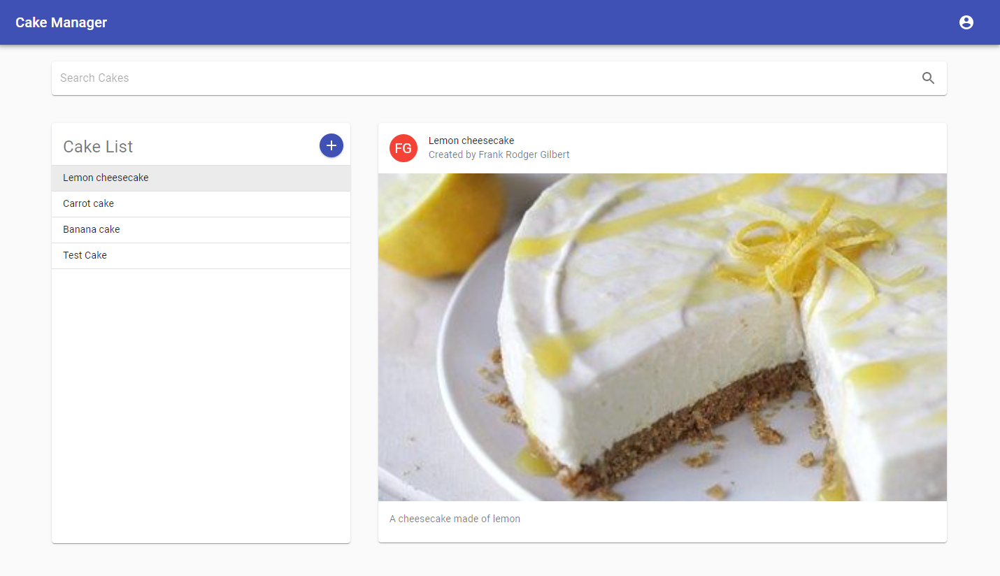
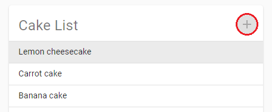
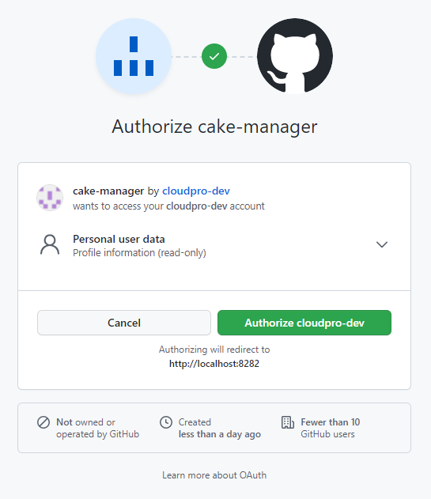
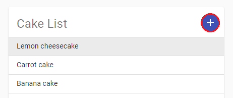
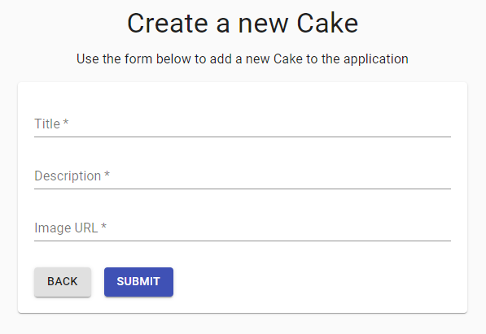
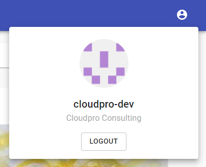

[](https://github.com/cloudpro-dev/spring-security-oauth2-login/releases/latest)
[](https://github.com/cloudpro-dev/cake-manager/actions/workflows/docker.yaml)
[](https://github.com/sqshq/PiggyMetrics/blob/master/LICENCE)

# Cake Manager Micro Service (fictitious)

# Requirements

A summer intern started on this project but never managed to get it finished.
The developer assured us that some of the above is complete, but at the moment accessing the /cakes endpoint
returns a 404, so getting this working should be the first priority.

Requirements:
* By accessing the root of the server (/) it should be possible to list the cakes currently in the system. This must be presented in an acceptable format for a human to read.
* It must be possible for a human to add a new cake to the server.
* By accessing an alternative endpoint (/cakes) with an appropriate client it must be possible to download a list of
  the cakes currently in the system as JSON data.
* The /cakes endpoint must also allow new cakes to be created.

Comments:
* We feel like the software stack used by the original developer is quite outdated, it would be good to migrate the entire application to something more modern.
* Would be good to change the application to implement proper client-server separation via REST API.

Bonus points:
* Tests
* Authentication via OAuth2
* Continuous Integration via any cloud CI system
* Containerisation

# Design

The overall objective is to keep the design as simple as possible whilst meeting all the requirements.

To fulfill the requirements stated above the following design was provided.

## Scope

Given the lack of detail in the requirements some assumptions have been made about the scope:
1. For the purposes of this demo all code should reside with in a single application
2. Due to the requirement for a human to be able to read the list of cakes and to be able to add new cakes, a client must be developed to provide this function.
3. A local in-memory H2 database provides persistence for the application for the purposes of this demo.
4. OAuth2 authentication is handled by an external provider (GitHub) for the purposes of this demo
5. Viewing the cakes is an anonymous operation
6. Creating new cakes is an authorised operation
7. No features are provided to edit or delete the existing cakes

**Important:** Given the requirement to provide OAuth2 authentication and thus a user context, it was decided to make the creation of new cakes an `authorised operation`.  To be able to add a new Cake to the application you must have logged in using a valid GitHub account. 

## Server-side
Provides a REST-API for authentication and cake services.

The server-side application is built using the following technology:

[Spring Boot](https://spring.io/projects/spring-boot) - Latest Spring Boot implementation  
[Spring Security](https://spring.io/projects/spring-security) - Secure web endpoints and OAuth2 client for GitHub access   
[Spring Data](https://spring.io/projects/spring-data) - JPA based persistence to local database
[Spring Test]() - Unit and Integration testing  
[H2](https://www.h2database.com/html/main.html) - Local in-memory database   
[MapStruct](https://mapstruct.org/) - Mapping library

### Controller
The Cake Controller defines the REST-API endpoints and provides [data conversion](#data-transfer-object) and [exception translation](#exception-translation) between the application services and the client.

### Data Transfer Object

Using a Data Transfer Object (DTO) even for a simple application allows for:
- loose coupling between the application layers 
- constraints to be applied to incoming data using Javax validation

To avoid unnecessary, error-prone, conversion of the JPA entity to DTO the application uses the [MapStruct](https://mapstruct.org/) library.

### Exception translation
All validation for the application data is handled on the server-side.

When an object sent to the Controller fails Javax validation, it will throw a validation exception.

The `ExceptionTranslator` captures validation errors and converts the details to an object that can be transmitted to the client.  This allows the client to provide feedback to the user about the invalid field.

## Client-side
Provides a browser based client which a human can use to search, view and add cakes to the system.



The client-side architecture is built using the following technology:

[React 17+](https://reactjs.org/) - Library for building user interfaces  
[Axios](https://github.com/axios/axios) - HTTP client providing extensible interfaces  
[Material UI](https://material-ui.com/) - Highly accessible web design toolkit

The source code is transpiled by [Babel](https://babeljs.io/) to ensure backward compatability.

The source code uses [ESLint](https://eslint.org/) to ensure quality and consistency of code.

## Security

### Authentication via OAuth2

To demonstrate OAuth2 authentication using a single application, OAuth2 authentication is handled by an external provider, namely GitHub.

This configuration provides the advantage of a user context without the overhead of maintaining a local repository of users.

For the purposes of this demo:
- Anonymous users can view the existing cakes, which can also be read, as JSON, via the `/cake` endpoint
- Authorised user **only** will have the ability to **add a new cake** to the application via the client or `/cake` endpoint

### Authorisation Flow

The instructions below detail the login process and basic authorised functions.

When the application first loads the `Add Cake` button is disabled by default.



To enable the button you must first log in to the application using the `Login` button in the header.


You will be redirected to the GitHub authorisation page for the `cake-manager` application.

You must click the green `Authorize` button to proceed. 



You will be redirected once again, back to the application.

You will notice that the login button has been replaced by a profile icon:


and that the `Add Cake` button is now enabled.



If you click on the `Add Cake` button you will see the new Cake form.

Enter the details of the cake into this form and then click the `Submit` button.



If any field is invalid, you will see an error message displayed.


Once all fields have been validated, you will be redirected back to the main page and a success message will be shown.


When creating a new Cake, the authenticated users GitHub OAuth2 `login` identifier will be stored in the local database.

The application will show the GitHub identifier as the name of the user who created the cake.


To view the name of your GitHub user, click the profile icon in the header.

This screen also provides the logout functionality.



## Requirements
- Java 11+

## Optional
- Node v11+ - Required for React client development only
- Docker - Required for building and managing Container images during development only

# Getting started

## Build the application
```shell
./mvnw package
```

## Start the application
Start the application providing your GitHub API secret credentials:
```shell
java \
  -Dspring.security.oauth2.client.registration.github.clientId="d482bc606f86d1d696dd" \
  -Dspring.security.oauth2.client.registration.github.clientSecret="08a805c6a3cd2718f4ab17b5b90398fac966ea58" \
  -jar target/cake-manager.jar
```
**Note:** The credentials shown above should work for demo purposes

If you wish to use Maven to execute the application then use the following command:
```shell
./mvnw spring-boot:run -Dspring-boot.run.jvmArguments="-Dspring.security.oauth2.client.registration.github.clientId=d482bc606f86d1d696dd -Dspring.security.oauth2.client.registration.github.clientSecret=08a805c6a3cd2718f4ab17b5b90398fac966ea58"
```

## Access the client
Open a web browser at the following location to access the main application client:
```
http://localhost:8282
```

## Read all Cakes
From the CLI you can run the following command to get a JSON download of the available Cakes.
```shell
curl -X GET http://localhost:8282/cakes
```

```json
[
    {
        "id": 1,
        "title": "Lemon cheesecake",
        "description": "A cheesecake made of lemon",
        "imageUrl": "https://s3-eu-west-1.amazonaws.com/s3.mediafileserver.co.uk/carnation/WebFiles/RecipeImages/lemoncheesecake_lg.jpg",
        "createdBy": "gerald432"
    },
    {
        "id": 2,
        "title": "Carrot cake",
        "description": "Bugs bunnys favourite",
        "imageUrl": "http://www.villageinn.com/i/pies/profile/carrotcake_main1.jpg",
        "createdBy": "humphrey11"
    },
    {
        "id": 3,
        "title": "Banana cake",
        "description": "Donkey kongs favourite",
        "imageUrl": "http://ukcdn.ar-cdn.com/recipes/xlarge/ff22df7f-dbcd-4a09-81f7-9c1d8395d936.jpg",
        "createdBy": "sharron21"
    }
]
```

## Testing
When the Maven `package` target is run, all client-side and server-side tests will be executed as part of the build.

### React  (Client-side)
All testing is performed using the [Jest](https://jestjs.io/docs/tutorial-react) test runner and the React [Testing Library](https://testing-library.com).

In line with the design principles of this library, all tests are engineered from the perspective of the user.

To start the test runner use the following command:
```shell
npm run test
```
Any changes to the files in the `client` directory will cause the relevant test suite to be executed, providing immediate feedback during development.
```
Test Suites: 9 passed, 9 total
Tests:       27 passed, 27 total
Snapshots:   0 total
Time:        12.893 s
Ran all test suites.
```

### Spring (Server-side)
Various tests covering the controller, repository, service, security, mapping, and application context.

To execute the Spring Test suite use the following command:
```shell
./mvnw test
```
```
[INFO] Results:
[INFO]
[INFO] Tests run: 13, Failures: 0, Errors: 0, Skipped: 0
```

## Containerisation

Containerisation is provided by means of a [Dockerfile](https://docs.docker.com/engine/reference/builder/).

You can build and manage the container using the following Docker commands:

Build the application
```shell
./mvnw package
```

Build the Docker image:
```shell
docker image build -t cloudproconsulting/cake-manager:latest .
```

Start the container:
```shell
docker container run \
--env GITHUB_API_CLIENT_ID=d482bc606f86d1d696dd \
--env GITHUB_API_CLIENT_SECRET=08a805c6a3cd2718f4ab17b5b90398fac966ea58 \
--publish 8282:8282 \
--detach \
--name cake-manager \
cloudproconsulting/cake-manager:latest
```

Get direct access to the container:
```shell
docker exec -it cake-manager //bin//sh
printenv
```

## Continuous Integration

Given the use of GitHub for SCM and authentication, the use of [GitHub Actions](https://docs.github.com/en/actions) to provide Continuous Integration (CI) functions was an obvious choice.

The requirements do not mention Continuous Deployment (CD) but a public Docker Hub image can be used as an input into any deployment process.

GitHub CI workflow configuration for the project:
```shell
.github/workflows/docker.yaml
```

The configuration will perform the following steps:
1. Checkout code from GitHub
2. Setup Java 11
3. Build the application using Maven
4. Build Docker image
5. Login and push image to Docker Hub

The configuration will be triggered when:

- Git Push on the `main` branch
- Git Tag with a `v` prefix, e.g. `v1.0`
- GitHub Pull Request on the `main` branch 

**Note:** No Docker image will not be pushed for GitHub Pull Requests

You can view a [list of published images](https://hub.docker.com/repository/docker/cloudproconsulting/cake-manager) on Docker Hub once the build has completed.

The Docker image created in Docker Hub will be tagged based on the type of event triggered in GitHub:
- Git Push to `main` branch will create/update Docker image tagged `main`
- Git Tag with a `v` prefix will create/update Docker image tagged `latest`
- Git Tag with a `v` prefix will create/update Docker image tagged with the version number e.g. `v1.0`

**Important** 

The workflow requires that you have set up two pre-defined [secrets in GitHub](https://docs.github.com/en/actions/reference/encrypted-secrets) with the following identifiers:
- DOCKERHUB_USERNAME
- DOCKERHUB_TOKEN

_These values should correspond to an [Access Token](https://docs.docker.com/docker-hub/access-tokens/) that you have previous setup in Docker Hub._

# Development
Whilst developing the application the following information may prove useful:

## Server-side

The base schema can be found in `src/resource/schema.sql`

The base data for the application can be found in `src/resource/data.sql`

Messages for failed validation are found in `src/resources/messages.properties`

## Client-side

React client development is de-coupled from the Spring Boot application to ensure that separate teams can work on each part of the system independently.

To start developing the React application:
```shell
cd client
npm run start
```

The application will become available at the URL:
```shell
http://localhost:3000
```

This will start the application in `development` mode which provides several features:
1. Watches the files in the `client/src` directory for changes and recompiles
2. Hot-reloading in browser for transparent updates
3. Static data fixtures for Cake list
4. Pre-authenticated user to allow access to all part of the application

When running in `development` mode the data for the application will be loaded from `client/src/data-common.js`